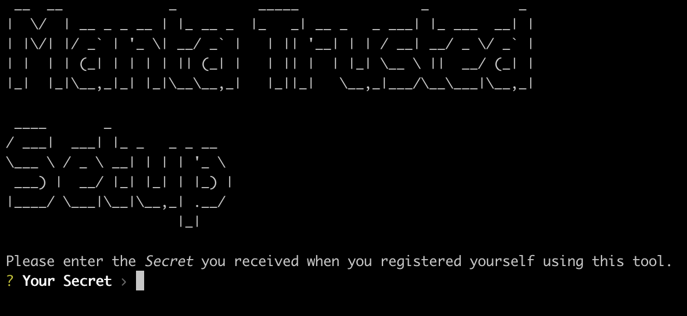
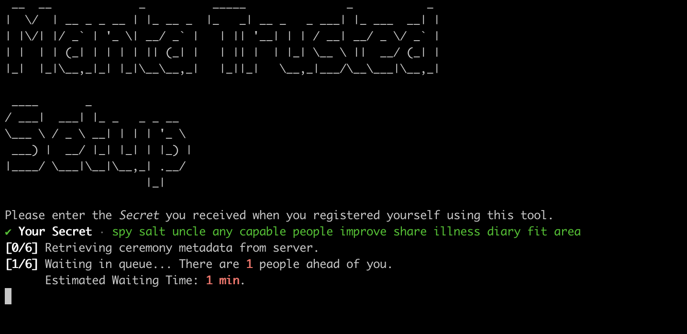
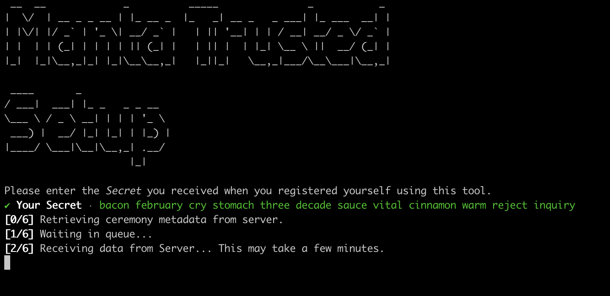
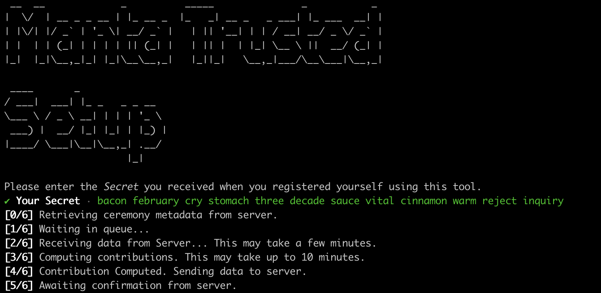
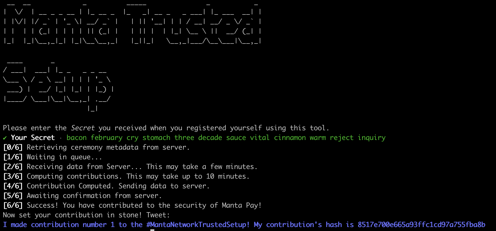

# manta-trusted-setup

For support, please contact us on [Discord](https://discord.gg/AZTZvK7X).

This guide explains how to install and run the client from source code. Users who do not wish to inspect the source code themselves are encouraged to follow the instructions for a quick download [here](https://docs.manta.network/docs/guides/TrustedSetup). The remainder of this guide assumes that the user wishes to install from source code.

To build the trusted setup client from source code you will need the Rust compiler. If you do not have this installed, follow the OS-specific instructions [here](https://www.rust-lang.org/tools/install). If you already have Rust installed make sure you are using the latest version by running the `rustup update` command.

## Installation
After installing Rust, clone this repository to your computer. Open a terminal, navigate to the folder where you wish to install the client, and use the command
```sh
git clone https://github.com/Manta-Network/manta-rs.git
```

## Registration
To use the client for registration: open a terminal, navigate to the folder where you downloaded the client, and use the command
```sh
cargo run --release --package manta-trusted-setup --all-features --bin groth16_phase2_client register
```
You will see a screen like this 

Enter the required information (Twitter handle and email address) and copy these together with the public key and signature generated by the client into the appropriate fields of [this form](https://4z64on4g0gg.typeform.com/to/N7afxPaU). DO NOT include the secret passphrase displayed in red. Save this secret phrase somewhere safe and do not share it with anyone. Without this secret you will not be able to participate in the ceremony. You are now registered; please wait until the ceremony begins to proceed to the next step. You will be notified by email when the ceremony is about to begin.

> **NOTE**: There may be some lag between when you submit your registration info and when it has been uploaded to the server -- we perform some manual screening to prevent abuse. 

## Contribution
At any time when the ceremony is open, you may contribute using the same client you already installed. Open a terminal, navigate to the folder where you downloaded the client, and use the command
```sh
cargo run --release --package manta-trusted-setup --all-features --bin groth16_phase2_client contribute
```
You will first be prompted for the passphrase you generated above:


After entering your secret, you will see a screen like this 
Most likely you will have to wait in a queue; this is because there are many participants in the ceremony and only one can contribute at a time. Do not take any action. Just leave this terminal open until the process completes.

When you reach the front of the queue you will begin downloading data from the server:


Then the client will begin computing your contribution. Once this is complete, the result will be sent to the server:

The server will check the validity of your contribution. This may take a few minutes. Do not leave this process until you receive confirmation.

Once your contribution has been checked you will receive a confirmation message from the server:

Please finish your contribution by tweeting the message we provided (or posting to other public forums). While this step is not strictly necessary, it improves the security of the ceremony by creating a public record of your participation.